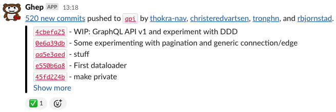
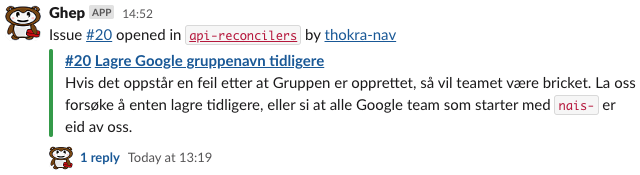
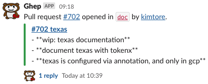
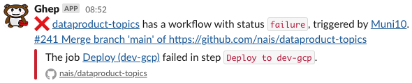

# Ghep event pusher

Ghep er en Github App som pusher Github events for teams til Slack.
Det som skiller Ghep fra en haug av andre lignende tjenester er at den automagisk henter repoer basert på Github _teamet_ ditt, og pusher forskjellige events til forskjellige kanaler!

## Hvordan ser det ut?

### Commits

Commits er kanskje den mest aktive hendelsen for et team.
For hver `push` blir det sendt en hendelse som blir postet til Slack.
Ghep vil prøve å lenke til `Co-Authors` så godt som mulig.

Hvis en `push` trigger en workflow så vil Ghep reacte på commits basert på reisen til workflowen.

:eyes: - når en jobb har blitt satt i kø  
:hourglass_flowing_sand: - når den kjører  
:white_check_mark: - fullført vellykket  
:x: - fullført feilet  
:parking: - fullført kansellert  



### Issues og pull requests

Issues og pull requests blir behandlet nesten likt, og ser like ut når de havner i Slack.
`merged` og `deleted` hendelser vil bli posted i Slack-tråden til et issue eller pull requests.
Dette gjør det enkelt for dere å følge med på hva som skjer.





### Workflows

Workflows som er vellykket er ikke så interessant, derfor er det kun workflows som feiler som blir postet til Slack.



## Ta den i bruk

Alt du trenger å gjøre er å redigere `.nais/teams.yaml` og legge til ditt team og deres kanaler.

``` yaml
nada:
 commits: "#nada-commits"
 issues: "#nada-issues"
 pulls: "#nada-pull-requests"
 workflows: "#nada-ci"
```

### Konfigurering

Vi har også støtte for litt konfigurering.
Dette legges under `teamnavn.config`.

#### Team configuration

``` yaml
team:
  config:
    ignoreRepositories:
      - repoA
      - repoB
    silenceDependabot: always
    externalContributorsChannel: "#channel"
```

- `ignoreRepositories` - En liste med repositories man ikke ønsker hendelser fra
- `silenceDependabot` - Hvis denne blir satt til `alwyas` så ignorer man alle hendelser fra Dependabot
- `externalContributorsChannel` - Issues og pull requests fra brukere som ikke er i teamet ditt vil havne i en egen kanal

#### Workflows

``` yaml
team:
  workflows: #channel
  config:
    workflows:
      ignoreBots: bool
      branches: [string]
```

- `ignoreBots` - Ikke få Slack-melding om workflows som feiler for bots (for eksempel Dependabot)
- `branches` - Få *kun* Slack-melding om workflows som feiler for spesifikke branches

## Lokal utvikling

Kjør opp Redis for testing med Docker.

``` shell
docker run --name redis -p 6379:6379 -d redis
```

## Kontakt oss

Ta kontakt i `#ghep-værsågod` på Slack hvis du har noen spørsmål.
