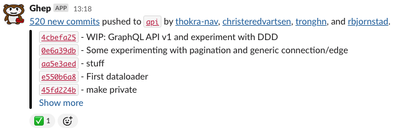
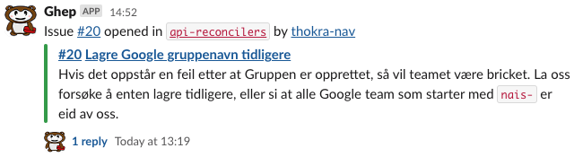
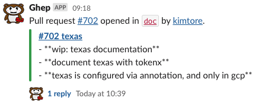
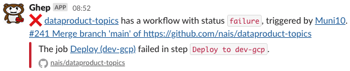
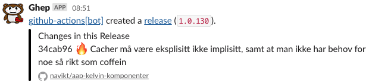
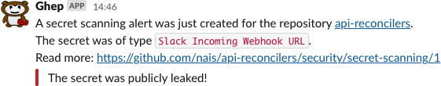

# Ghep event pusher

Ghep er en Github App som pusher Github events for teams til Slack.
Det som skiller Ghep fra en haug av andre lignende tjenester er at den automagisk henter repoer basert på Github _teamet_ ditt, og pusher forskjellige events til forskjellige kanaler!

## Hvordan ser det ut?

### Commits

Commits er kanskje den mest aktive hendelsen for et team.
For hver `push` blir det sendt en hendelse som blir postet til Slack.
Ghep vil prøve å lenke til `Co-Authors` så godt som mulig.

Hvis en `push` trigger en workflow så vil Ghep reacte på commits basert på reisen til workflowen.

👀 - når en jobb har blitt satt i kø  
⏳ - når den kjører  
✅ - fullført vellykket  
❌ - fullført feilet  
🅿️ - fullført kansellert  



### Issues og pull requests

Issues og pull requests blir behandlet nesten likt, og ser like ut når de havner i Slack.
`merged` og `deleted` hendelser vil bli posted i Slack-tråden til et issue eller pull requests.
Dette gjør det enkelt for dere å følge med på hva som skjer.





We also support a minimalist version of pull request without body.


### Workflows

Workflows som er vellykket er ikke så interessant, derfor er det kun workflows som feiler som blir postet til Slack.



### Releases

Sender releases til en egen kanal, `draft`, `prerelease`, og `releases` blir sendt ut.



### Security

Sender code scanning, secret scanning, Dependabot, og security advisory til egen kanal.
Noen av disse hendelsene kan man filtrere på alvorlighetsgrad.



## Ta den i bruk

Alt du trenger å gjøre er å redigere [`.nais/teams.yaml`](https://github.com/navikt/ghep/blob/main/.nais/teams.yaml) og legge til ditt team og deres kanaler.

``` yaml
nada:
 commits: "#nada-commits"
 issues: "#nada-issues"
 pulls: "#nada-pull-requests"
 workflows: "#nada-ci"
 releases: "#nada-releases"
 security: "#nada-security"
```

PS: Hvis kanalene dine er private må du selv invitere @ghep inn i hver kanal.

### Sources

Du kan også bruke `sources` for å sende samme hendelsestype til flere kanaler med forskjellig konfigurasjon.
For eksempel kan du sende pull requests fra bots til én kanal og resten til en annen.

``` yaml
nada:
  sources:
    - source: pulls
      channel: "#nada-pull-requests"
      config:
        pulls:
          ignoreBots: true
    - source: pulls
      channel: "#nada-bot-prs"
      config:
        pulls:
          onlyBots: true
    - source: commits
      channel: "#nada-commits"
    - source: commits
      channel: "#nada-commits-develop"
      config:
        branches:
          - develop
    - source: workflows
      channel: "#nada-ci"
      config:
        branches:
          - main
    - source: releases
      channel: "#nada-releases"
    - source: issues
      channel: "#nada-issues"
    - source: security
      channel: "#nada-security"
      config:
        security:
          severityFilter: "high"
```

Gyldige source-typer er: `commits`, `pulls`, `issues`, `workflows`, `releases`, `security`.

Du kan kombinere det gamle formatet med `sources`. Flate kanaler (f.eks. `commits: "#kanal"`) blir alltid inkludert, og eksplisitte `sources` legges til i tillegg.

``` yaml
nada:
  commits: "#nada-commits"
  pulls: "#nada-pull-requests"
  sources:
    - source: pulls
      channel: "#nada-bot-prs"
      config:
        pulls:
          onlyBots: true
```

I eksempelet over vil pull requests sendes til _både_ `#nada-pull-requests` (fra flat config) og `#nada-bot-prs` (fra sources).

### Konfigurering

Vi har også støtte for litt konfigurering.
Dette legges under `teamnavn.config` for globale innstillinger, eller per source under `sources[].config`.
Foreløpig er det tillat med blanding av gammel type konfigurasjon, og per source.
Overtid kommer konfigurasjon som kan brukes av flere sources bli flyttet.

#### Team configuration

Globale innstillinger som gjelder for alle sources:

``` yaml
team:
  config:
    ignoreRepositories:
      - repoA
      - repoB
    silenceDependabot: "always"
    externalContributorsChannel: "#channel"
    pingSlackUsers: true
```

- `ignoreRepositories` - En liste med repositories man ikke ønsker hendelser fra
- `silenceDependabot` - Hvis denne blir satt til `always` så ignorer man alle hendelser fra Dependabot
- `externalContributorsChannel` - Issues og pull requests fra brukere som ikke er i teamet ditt vil havne i en egen kanal
- `pingSlackUsers`- Pinger Slack-brukere som er tildelt issues eller pull requests

#### Source configuration

Dette er konfigurasjon som settes per source:

``` yaml
team:
  sources:
    - source: commits
      channel: "#channel"
      config:
        branches:
          - develop
          - staging
    - source: pulls
      channel: "#channel-prs-main"
      config:
        branches:
          - main
```

- `branches` - Få *kun* hendelser for de oppgitte branchene. For commits erstatter dette default branch for repoet. For pull requests filtreres det på target branch (base ref).

#### Pull Requests

Kan konfigureres globalt (under `config.pulls`) eller per source (under `sources[].config.pulls`):

``` yaml
team:
  pulls: "#channel"
  config:
    pulls:
      events: [string]
      ignoreBots: bool
      onlyBots: bool
      ignoreDrafts: bool
      minimalist: bool
```

- `ignoreBots` - Ikke få Slack-melding om Pull Request opprettet av bots
- `onlyBots` - Få *kun* Slack-melding om Pull Request opprettet av bots (nyttig for å sende Dependabot PRs til egen kanal)
- `ignoreDrafts` - Ignorer draft pull requests
- `minimalist` - Don't post the body as attachment, only add title to the message
- `events` - Filtrer hvilke pull request-hendelser du vil ha notifikasjoner for. Se [docs.github.com](https://docs.github.com/en/webhooks/webhook-events-and-payloads#pull_request) for komplett liste over events. For de fleste holder det med `opened`, `ready_for_review`, `merged`, `closed`. Merk at `merge` er kun en Ghep event, og er en kombinasjon av event `closed` og `pullRequest.merged: true`

#### Workflows

Kan konfigureres globalt (under `config.workflows`) eller per source (under `sources[].config.workflows`):

``` yaml
team:
  workflows: "#channel"
  config:
    workflows:
      ignoreBots: bool
      workflows: [string]
      repositories: [string]
```

- `ignoreBots` - Ikke få Slack-melding om workflows som feiler for bots (for eksempel Dependabot)
- `workflows` - Få *kun* Slack-melding om workflows som feiler for spesifikke workflows
- `repositories` - Få *kun* Slack-melding om workflows som feiler for spesifikke repositories

#### Security

Kan konfigureres globalt (under `config.security`) eller per source (under `sources[].config.security`):

``` yaml
team:
  security: "#channel"
  config:
    security:
      severityFilter: "high"
```

- `severityFilter` - Filtrer ut sikkerhetshendelser som har _lavere_ alvorlighetsgrad enn spesifisert

## Lokal utvikling

Kjør opp Postgres for testing med Docker.

``` shell
docker run --name postgres -e POSTGRES_PASSWORD=postgres -p 5432:5432 -d postgres
docker run --name adminer --link postgres:db -p 8081:8080 -d adminer
psql -h localhost -U postgres -c 'CREATE DATABASE ghep;'
```

## Kontakt oss

Ta kontakt i `#ghep-værsågod` på Slack hvis du har noen spørsmål.
